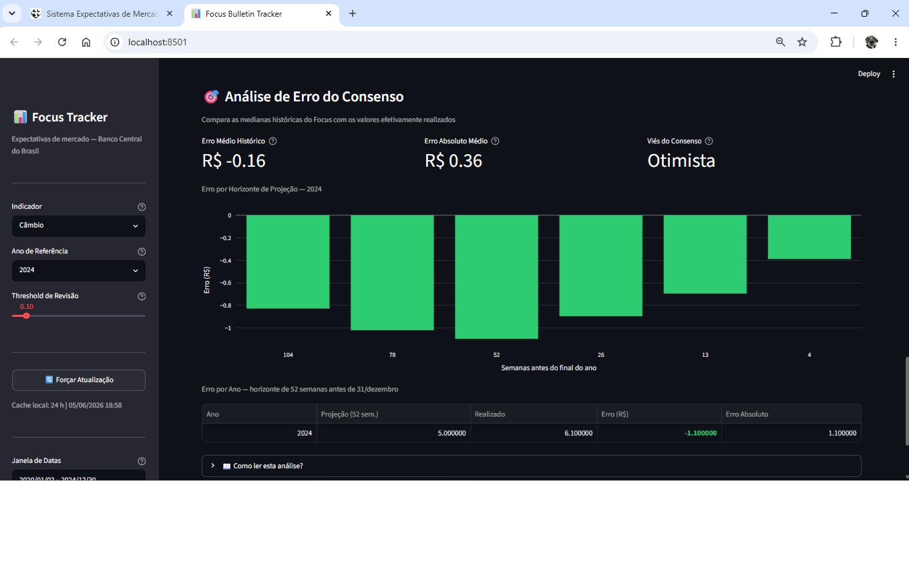

# 📊 Focus Bulletin Tracker

[](https://python.org)
[](https://streamlit.io)
[](https://plotly.com)
[](https://www.bcb.gov.br)
[](LICENSE)

### 🔗 [**Open the live app →**](https://focus-bulletin-tracker.streamlit.app)



An interactive Streamlit dashboard that tracks and visualizes the historical evolution of Brazil's **Focus Bulletin** market expectations, powered by the **Banco Central do Brasil (BCB) Olinda public API**.

> The Focus Bulletin (*Boletim Focus*) aggregates weekly forecasts from hundreds of financial institutions for key Brazilian macroeconomic indicators, published every Monday by the Central Bank of Brazil.

---

## ✨ Features

| Feature | Details |
|---------|---------|
| **Live data** | BCB Olinda REST API — no API key required |
| **Four indicators** | IPCA (inflation), Selic (interest rate), PIB Total (GDP), Câmbio (USD/BRL) |
| **Chart 1** | Median trend line with mean overlay and starred outlier highlights |
| **Chart 2** | Dispersion band (Min–Max shaded area) with ±1σ reference lines |
| **Chart 3** | Weekly revision bars (green = upward revision, red = downward) |
| **Summary metrics** | Latest median, period variation, max dispersion, weeks analyzed |
| **Last 8 weeks table** | Color-coded revision column (exceeds configurable threshold) |
| **3-layer cache** | Pre-generated Parquet → 24h SQLite cache → live BCB API |
| **Configurable threshold** | Slider to tune what counts as a "significant" revision |

---

## 🖥️ Screenshot


---

## 🛠️ Tech Stack

| Layer | Technology | Version |
|-------|-----------|---------|
| Dashboard framework | [Streamlit](https://streamlit.io) | 1.58 |
| Interactive charts | [Plotly](https://plotly.com/python/) | 6.8 |
| Data manipulation | [pandas](https://pandas.pydata.org) | 3.0 |
| Columnar storage | [pyarrow](https://arrow.apache.org/docs/python/) | 24.0 |
| HTTP client | [requests](https://requests.readthedocs.io) | 2.34 |
| Runtime | Python | 3.14 |
| Data source | BCB Olinda API | v1 |

---

## 🚀 Getting Started

### Prerequisites

- Python 3.14 or higher
- Internet access to reach `olinda.bcb.gov.br`

### Installation

```bash
# 1. Clone the repository
git clone https://github.com/cavalcantihumberto/focus-bulletin-tracker.git
cd focus-bulletin-tracker

# 2. Create and activate a virtual environment
python -m venv .venv

# Windows
.venv\Scripts\activate

# Linux / macOS
source .venv/bin/activate

# 3. Install dependencies
pip install -r requirements.txt
```

### Run

```bash
streamlit run app.py
```

The dashboard opens automatically at **http://localhost:8501**.

---

## 📁 Project Structure

```
focus-tracker/
├── app.py                  # Main Streamlit dashboard (entry point)
├── data/
│   ├── __init__.py
│   ├── fetcher.py          # BCB Olinda API client + 3-layer cache
│   └── processed/          # Pre-generated Parquet snapshots (per indicator/year)
├── analysis/
│   ├── __init__.py
│   └── metrics.py          # Revision, dispersion, summary & consensus-error calcs
├── scripts/
│   └── fetch_data.py       # Data pipeline — refreshes the Parquet snapshots
├── tests/                  # pytest suite (fetcher + metrics)
├── utils/
│   └── logger.py           # Rotating daily file logger
├── .github/
│   └── workflows/          # GitHub Actions — weekly data refresh
├── cache/                  # Auto-generated: local SQLite cache (focus_cache.db)
├── requirements.txt        # Pinned dependencies
├── README.md
├── LICENSE
└── .gitignore
```

---

## 🧪 Running tests

The project ships with a [pytest](https://docs.pytest.org) suite covering the data
fetcher and the metrics calculations.

```bash
pytest -v
```

---

## 📡 Data Source & API Reference

All data comes from the **[BCB Olinda Open Data API](https://olinda.bcb.gov.br/olinda/servico/Expectativas/versao/v1/swagger-ui3)** — a free, public REST/OData API maintained by the Banco Central do Brasil.

- **Service**: `Expectativas` v1
- **Endpoint used**: `ExpectativasMercadoAnuais` (annual market expectations)
- **Fields**: `Indicador`, `Data`, `DataReferencia`, `Mediana`, `Media`, `DesvioPadrao`, `Minimo`, `Maximo`
- **Full docs**: https://olinda.bcb.gov.br/olinda/servico/Expectativas/versao/v1/swagger-ui3
- **Open data portal**: https://dadosabertos.bcb.gov.br

---

## ⚙️ Configuration

All configuration is done interactively through the dashboard sidebar:

| Control | Description |
|---------|-------------|
| **Indicator** | IPCA, Selic, PIB Total, or Câmbio |
| **Reference Year** | Target year of the projections (last 4 years + current + next) |
| **Date Window** | Restrict the analysis to a specific date range |
| **Revision Threshold** | Minimum absolute change in median to flag as "significant" |
| **Force Update** | Bypass the 24h cache and fetch fresh data from the API |

---

## 🔄 Data Pipeline

A GitHub Actions workflow automatically refreshes all indicator data every week.

### Schedule

Runs every **Monday at 12:00 UTC** (09:00 Brasília time).  
Can also be triggered manually from the **Actions** tab → *Update Focus Bulletin Data* → **Run workflow**.

### Run manually

```bash
python scripts/fetch_data.py
```

Fetches all 4 indicators × 8 years (2022–2029) directly from the BCB API and saves the results to `data/processed/`.

### Generated files

```
data/processed/
├── IPCA_2022.parquet          # historical expectations per indicator/year
├── IPCA_2023.parquet
├── ...
├── Câmbio_2029.parquet
└── metadata.json              # last update timestamp + record counts
```

**`metadata.json` structure:**
```json
{
  "ultima_atualizacao": "2026-06-04T12:00:00Z",
  "versao_script": "1.0.0",
  "registros": {
    "IPCA/2025": 220,
    "Selic/2025": 218
  }
}
```

### Cache priority in the dashboard

The dashboard (`app.py`) resolves data in this order:

| Priority | Source | Validity |
|----------|--------|---------|
| 1 | `data/processed/*.parquet` | 7 days |
| 2 | `cache/focus_cache.db` (SQLite) | 24 hours |
| 3 | BCB Olinda API (live) | always fresh |

---

## 📄 License

[MIT](LICENSE) — free to use, modify, and distribute.
